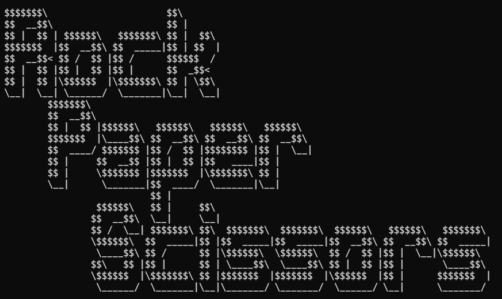

# Rock, Paper, Scissors Python Console Game

The game follows the same rules as the traditional game. You can choose Rock, Paper, or Scissors.

Rules:
 - Paper beats Rock
 - Rock beats Scissors
 - Scissors beats Paper

It has some graphics due to using ASCII character art in the console.

You can close the game at anytime by entering "q" or "Q" for Quit.

Demo:

https://drive.google.com/file/d/1dGEru7UZvZUl0yKYhoF0_8xrA_9y9ax1/view?usp=drive_link